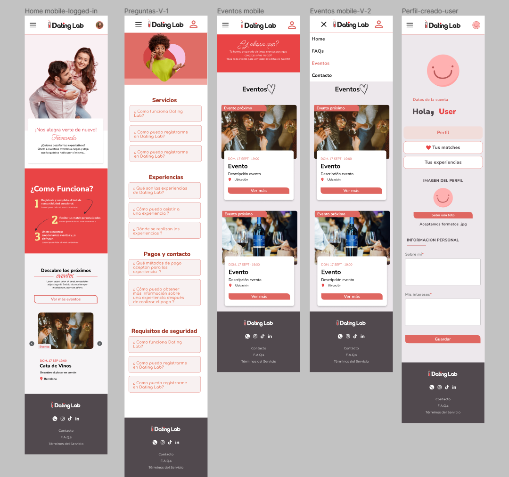
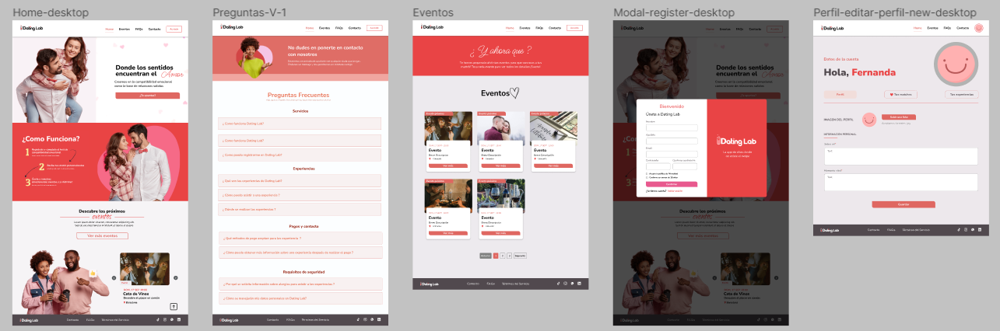

## Team Cod<3rs 👋

The Cod<3rs Team is pleased to present an exciting project that we had the opportunity to work on.

## About this Project

DatingLab is a platform designed to streamline connections between individuals seeking romantic relationships, fostering meaningful interactions and partnerships in the dating sphere. It stands out for its focus on facilitating matches between compatible users and organizing exclusive events for them to meet in person.


## More details about DatingLab

Upon accessing the page, users are greeted with an intriguing introduction focused on finding their ideal partner through sensory connection. The first step is to fill out a form that assesses compatibility with other users, providing valuable match recommendations. They are then given the exciting opportunity to attend exclusive sensory events, where they can meet their potential matches in person and have a unique experience. To access these events, users have the option to pay for individual events or subscribe to a monthly membership to this unique sensory experience.

## Screenshots




## 📌 Requirements

- Visual Studio Code
- Node.js installed on the computer

## ⚙️ Installation

- This repository is the Frontend where the visual part of the website is, to install it on the computer you must follow these steps:

1- Clone the repository:

```

git clone https://github.com/FemCodersP4/thedatinglab-front.git

```

2- Put in the terminal within the project:

```

npm install

```

3- Go to the client folder with this command in the terminal:

```

cd client

```

4- To open and see the website in the terminal you have to enter

```

npm run dev

```

# 🧪 Running Tests

To run tests, run the following command:
1- Go to the client folder with this command in the terminal:

```

cd client

```

2- Run the tests:

```

npm run test

```

## 💻 Technologies Used


## 🛠️ Tools

[](https://code.visualstudio.com/)&nbsp;
[](https://www.postman.com/)&nbsp;
[](https://trello.com/)


## 🔗Authors

**Hemi:**

- LinkedIn: [link to Hemi's LinkedIn profile](https://www.linkedin.com/in/hemileidis/)
- GitHub: [link to Hemi's GitHub profile](https://github.com/HemiCastillo)

**Fefy:**

- LinkedIn: [link to Fefy's LinkedIn profile](https://www.linkedin.com/in/stefania-desogus/)
- GitHub: [link to Fefy's GitHub profile](https://github.com/stef-ania)

**Laura:**

- LinkedIn: [link to Laura's LinkedIn profile](https://www.linkedin.com/in/laura-gil-solano/)
- GitHub: [link to Laura's GitHub profile](https://github.com/ImLauraGS)

**Alicia:**

- LinkedIn: [link to Alicia's LinkedIn profile](www.linkedin.com/in/alicia-ontiveros-escudero)
- GitHub: [link to Alicia's GitHub profile](https://github.com/AliciaoE)

**Debora:**

- LinkedIn: [link to Debora's LinkedIn profile](https://www.linkedin.com/in/debora-smenezes/)
- GitHub: [link to Debora's GitHub profile](https://github.com/debora-smb)

**Jessica:**

- LinkedIn: [link to Jessica's LinkedIn profile](www.linkedin.com/in/jéssicazs)
- GitHub: [link to Jessica's GitHub profile](https://github.com/Jasz-17)

**Gabriela:**

- LinkedIn: [link to Gabriela's LinkedIn profile](https://www.linkedin.com/in/gabriela-poves-navarro/)
- GitHub: [link to Gabriela's GitHub profile](https://github.com/annaLucian)

**Carolina:**

- LinkedIn: [link to Carolina's LinkedIn profile] (if available)
- GitHub: [link to Carolina's GitHub profile] (if available)
