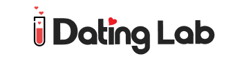

# Dating Lab 

# Team Cod<3rs 👋
The Cod<3rs Team is pleased to present an exciting project that we had the opportunity to work on.

## OBJECTIVE OF THE PROJECT 
A responsive website where you can manage users, both registered and not, so that they can see what the page is about, and decide if they are interested in immersing themselves in a space where, apart from meeting your ideal partner, you can experience unique events where you can have a good time, and meet people with whom you share your same tastes.

## About this project
Upon accessing the page, users are greeted with an intriguing introduction focused on finding their ideal partner through sensory connection. The first step is to fill out a form that assesses compatibility with other users, providing valuable match recommendations. They are then given the exciting opportunity to attend exclusive sensory events, where they can meet their potential matches in person and have a unique experience. To access these events, users have the option to pay for individual events or subscribe to a monthly membership to this unique sensory experience.

## Screenshots 

## 📌 Requirements

* Visual Studio Code
* Node.js installed on the computer

## ⚙️ Installation

This repository is the Frontend where the visual part of the website is, to install it on the computer you must follow these steps:

1- Clone the repository

2- Put in the terminal within the project

npm install

3- To open and see the website in the terminal you have to enter

npm run dev

## 🛠️ Tools

* HTML: 5,
* CSS: 3,
* Javascript: "^3.0.5",
* React.js: "^18",
* Jest: "^29.7.0",
* Next: "14.1.0",
* Tailwind: "^3.0.6",
* Axios: "^1.6.7",

# 🧪 Running Tests
To run tests, run the following command

  npm run test

## 🔗 Information about the programmers

**Hemi:**

- LinkedIn: [link to Hemi's LinkedIn profile](https://www.linkedin.com/in/hemileidis/)
- GitHub: [link to Hemi's GitHub profile](https://github.com/HemiCastillo)

**Fefy:**

- LinkedIn: [link to Fefy's LinkedIn profile](https://www.linkedin.com/in/stefania-desogus/)
- GitHub: [link to Fefy's GitHub profile](https://github.com/stef-ania)

**Laura:**

- LinkedIn: [link to Laura's LinkedIn profile](https://www.linkedin.com/in/laura-gil-solano/)
- GitHub: [link to Laura's GitHub profile](https://github.com/ImLauraGS)

**Alicia:**

- LinkedIn: [link to Alicia's LinkedIn profile](www.linkedin.com/in/alicia-ontiveros-escudero)
- GitHub: [link to Alicia's GitHub profile](https://github.com/AliciaoE)

**Debora:**

- LinkedIn: [link to Debora's LinkedIn profile](https://www.linkedin.com/in/debora-smenezes/)
- GitHub: [link to Debora's GitHub profile](https://github.com/debora-smb)

**Jessica:**

- LinkedIn: [link to Jessica's LinkedIn profile](www.linkedin.com/in/jéssicazs)
- GitHub: [link to Jessica's GitHub profile](https://github.com/Jasz-17)

**Gabriela:**

- LinkedIn: [link to Gabriela's LinkedIn profile](https://www.linkedin.com/in/gabriela-poves-navarro/)
- GitHub: [link to Gabriela's GitHub profile](https://github.com/annaLucian)

**Carolina:**

- LinkedIn: [link to Carolina's LinkedIn profile] (if available)
- GitHub: [link to Carolina's GitHub profile] (if available)